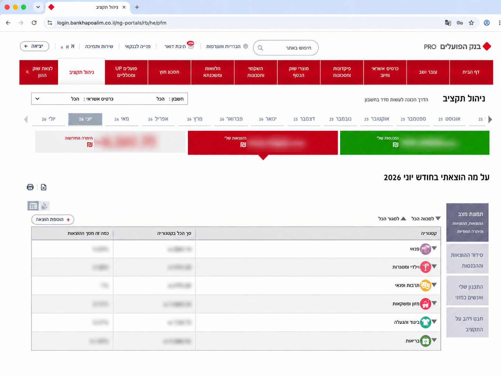
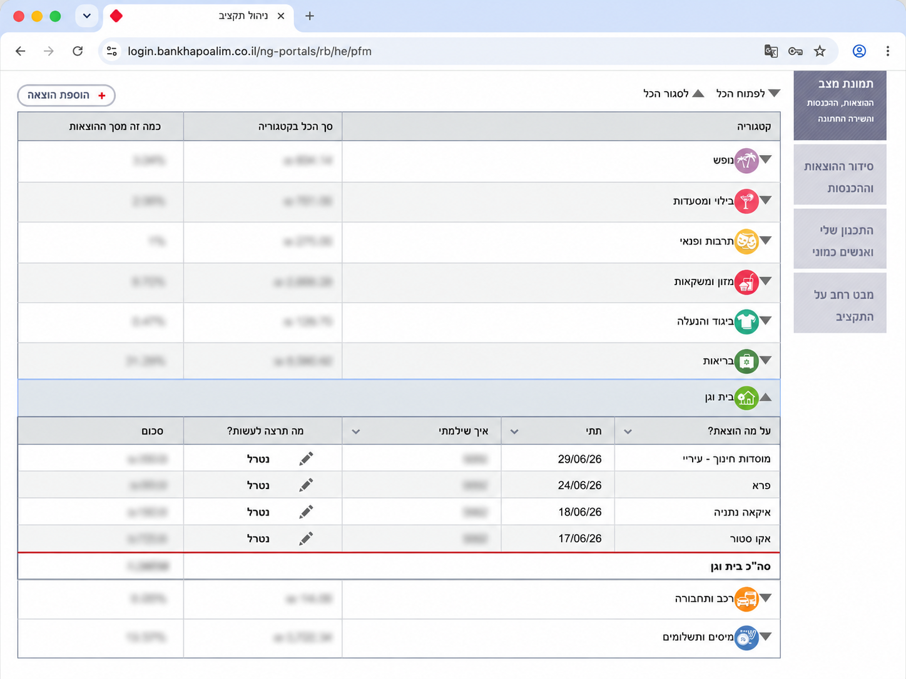

# hapoalim-budget-export

Export income and expenses from Bank Hapoalim’s **ניהול תקציב** (budget management) page into a flat CSV for spreadsheets.

## Why this exists

In your [Bank Hapoalim](https://www.bankhapoalim.co.il/) personal area, **ניהול תקציב** shows spending and income from every source — account debits, cards, transfers, and more. Useful to browse, painful to analyze: categories are nested, months sit on separate tabs, and the data you need is buried inside expandable rows.

This tool uses [Playwright](https://playwright.dev/) on your machine to open that page, expand everything, and write one table to `output/`.

## What the bank page looks like

Log in and open **ניהול תקציב** in your personal cabinet. You get month tabs, income/expense summary cards, and a category table — one row per budget category with its monthly total.

**General view** — categories collapsed; you see totals but not individual transactions:



**Expanded category** — in the bank UI you can open **one category** at a time (as in the screenshot below) or click **לפתוח הכל** (“open all”) to unfold every category at once. Either way, a sub-table appears with each transaction: description, date, how you paid, amount. The script clicks **לפתוח הכל** automatically and reads all sub-tables, for both **הכנסות** and **הוצאות**:



## Requirements

- **[Node.js](https://nodejs.org/en/download)** v18 or newer (includes `npm`)

Clone the repo, then run **`npm install`**. That does two things:

1. Installs the [Playwright](https://playwright.dev/) npm package (the only project dependency).
2. Runs `playwright install chromium` automatically — downloads a local Chromium build the script uses to open the bank page.

Nothing else is required. No global tools, no separate browser install.

## Quick start

```bash
git clone <this-repo>
cd hapoalim-budget-export
npm install
npm run collect
```

1. A browser window opens on the Hapoalim login page.
2. Log in manually (including OTP if the bank asks).
3. The script waits until you reach **ניהול תקציב**, collects data, and saves a CSV under `output/`.
4. The browser closes. No session data is saved — see [Security and privacy](#security-and-privacy).

```bash
npm run collect -- 2026/04-2026/06
npm run collect -- 2026/06/01-2026/06/30
npm run collect -- 2026/06 --json    # optional JSON after the date
```

## Date ranges

| Argument | Meaning |
|----------|---------|
| *(none)* | Latest month available on the bank’s month tabs |
| `2026/06` | Full June 2026 |
| `2026/04-2026/06` | Full months April–June 2026 |
| `2026/06/01-2026/06/30` | Exact inclusive dates |

Months with no tab or no data yet are skipped silently.

## Output format

File: `output/hapoalim_<start>_<end>.csv`. Add `--json` after the date for JSON too (e.g. `npm run collect -- 2026/06 --json`).

| Column | Description |
|--------|-------------|
| `סוג` | `הכנסות` (income) or `הוצאות` (expenses) |
| `קטגוריה` | Budget category |
| `תיאור` | Transaction description |
| `תאריך` | Date `YYYY/MM/DD` |
| `חשבון` | Account or last digits of card |
| `סכום` | Amount (no `₪`, commas, or spaces) |

Sample output (anonymized; full files in [`examples/`](examples/)):

| סוג | קטגוריה | תיאור | תאריך | חשבון | סכום |
|-----|---------|-------|-------|-------|------|
| הכנסות | משכורת/קצבה | משכורת-נט | 2026/06/14 | 123-456789 | 10000.00 |
| הכנסות | הכנסות אחרות | ביטוח לאומי | 2026/06/02 | 123-456789 | 500.00 |
| הכנסות | הכנסות אחרות | העברה מחשבון חיסכון | 2026/06/11 | 123-456789 | 500.00 |
| הוצאות | נופש | OPENAI *CHATGPT SUBS | 2026/06/20 | 4321 | 60.00 |
| הוצאות | נופש | GOOGLE YOUTUBEPREMIU | 2026/06/24 | 4321 | 45.00 |
| הוצאות | בילוי ומסעדות | קפה ג'ו | 2026/06/18 | 8765 | 20.00 |

**Do not commit your real `output/` files** — they contain financial data. The `output/` folder is gitignored.

## How it works

See [docs/architecture.md](docs/architecture.md) for the module layout and data flow.

## Security and privacy

This tool runs **entirely on your machine**. It is plain Node.js + Playwright — no third-party APIs, no LLMs, no cloud. Your bank login and transaction data are not sent anywhere except between your browser and Bank Hapoalim, as in normal online banking.

**Default (`npm run collect`):** a temporary browser opens, you log in, the script writes CSV (and optional JSON) to `output/`, then the browser closes. Aside from those export files, **nothing is left on disk** — no saved cookies, no browser profile.

**Your exports are yours.** Use them however you like. Once the files exist on your computer, who you share them with is your responsibility — treat them like any sensitive financial document.

**Optional persistent session (not default):** for development, you can keep a browser logged in to the bank between runs (`npm run dev:keep-open` + `collect --keeper`). That stores a session on disk and is riskier. Ignore this unless you are actively working on the scraper; see [For maintainers](#for-maintainers).

---

## For maintainers

```bash
npm run dev:keep-open
npm run collect -- 2026/06 --keeper
npm run dev:snapshot
```

Technical notes: [docs/developer-notes.md](docs/developer-notes.md)
