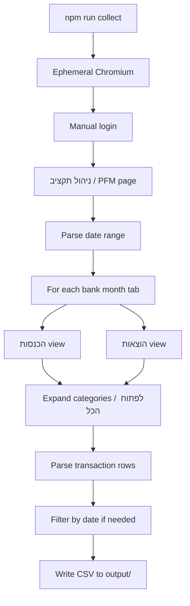

# Architecture

How `npm run collect` turns the Bank Hapoalim budget page into a CSV file.

## End-to-end flow



## Modules

| Module | Role |
|--------|------|
| `scripts/collect.js` | CLI entry: parse args, open browser, write output |
| `lib/browser-launch.js` | Ephemeral session (default) or CDP keeper (`--keeper`) |
| `lib/collect-session.js` | Multi-month pipeline: select tabs, collect both views |
| `lib/collect-transactions.js` | Expand categories, parse rows, CSV formatting |
| `lib/date-range.js` | Parse `2026/04-2026/06` style arguments |
| `lib/pfm-helpers.js` | Iframe access, readiness checks, mode switch |

## Bank page structure

The budget UI lives inside `main iframe` on the PFM URL. The outer page handles bank navigation; scraping runs almost entirely inside the iframe.

Key UI elements (Hebrew labels):

- **ניהול תקציב** — budget management section
- Month tabs — buttons like `יוני 26` (Hebrew month + 2-digit year)
- **ההכנסות שלי** / **ההוצאות שלי** — income / expenses summary cards
- **לפתוח הכל** — expand all category rows
- Category rows — `tr.expandable-row[role="button"]` with nested transaction tables

## Output row

Each CSV row is one transaction:

| Field | Source |
|-------|--------|
| `סוג` | View being collected (`הכנסות` or `הוצאות`) |
| `קטגוריה` | Parent category row |
| `תיאור` | Transaction description column |
| `תאריך` | Converted from `DD/MM/YY` to `YYYY/MM/DD` |
| `חשבון` | Account number or card last digits |
| `סכום` | Amount, stripped of `₪`, commas, spaces |

## Date ranges

1. Compute which calendar months overlap the requested range.
2. Collect only month tabs that exist on the bank UI (missing months are skipped silently).
3. For month-only ranges (`2026/04-2026/06`), include all rows from collected months.
4. For day-precise ranges (`2026/05/01-2026/06/15`), filter rows by `תאריך` after collection.

## Developer workflow

For selector debugging with a persistent session, see [developer-notes.md](developer-notes.md) and the scripts in `dev/`:

```bash
npm run dev:keep-open
npm run dev:snapshot
npm run collect -- --keeper 2026/06
```

Normal users should only need `npm run collect`.
